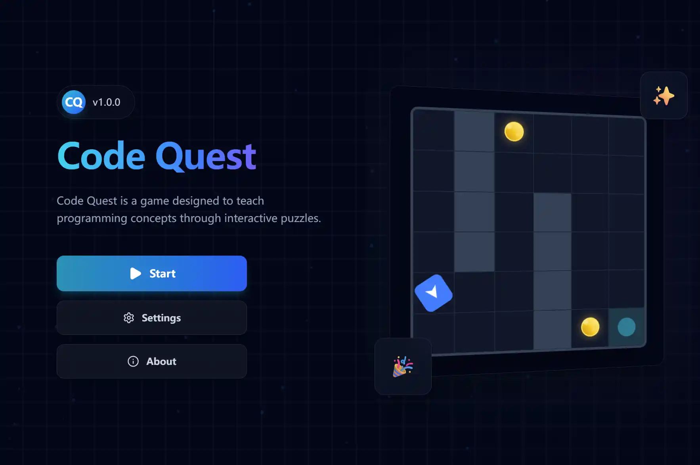

<div align="center">

# Code Quest

[](https://reactjs.org/)
[](https://www.typescriptlang.org/)
[](https://vitejs.dev/)
[](https://tailwindcss.com/)
[](https://microsoft.github.io/monaco-editor/)

Code Quest is a game designed to teach programming concepts through interactive puzzles.

[English](README.md) | [中文](README_zh.md)



</div>

## ✨ Key Features

- **Professional IDE**: Powered by **Monaco Editor**, featuring IntelliSense, syntax highlighting, and advanced editor configurations.
- **Reactive Game Engine**: A custom-built, state-driven engine for real-time code interpretation and sandboxed execution.
- **Persistent Progression**: Automatic synchronization of game progress and code snippets to local storage.
- **Multilingual Support**: Seamless switching between English and Simplified Chinese.

## 🛠️ Technical Architecture

- **Frontend**: React 18, TypeScript, Tailwind CSS, Framer Motion.
- **Core Logic**: Custom hooks for game state management and execution lifecycle.
- **Editor**: Integration with `@monaco-editor/react` for a robust coding environment.

## 🚀 Getting Started

1. Clone the repository:
   ```bash
   git clone https://github.com/Roy-Jin/Code-Quest.git
   ```
2. Install dependencies:
   ```bash
   npm install
   ```
3. Start the development server:
   ```bash
   npm run dev
   ```

---

Built with ❤️ by [Roy-Jin](https://github.com/Roy-Jin).
