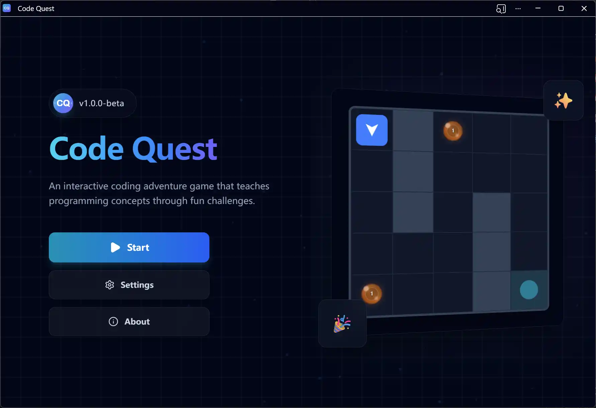

<div align="center">


# Code Quest

[](https://reactjs.org/)
[](https://www.typescriptlang.org/)
[](https://vitejs.dev/)
[](https://tailwindcss.com/)
[](https://microsoft.github.io/monaco-editor/)
[](https://web.dev/explore/progressive-web-apps)

An interactive coding adventure game that teaches programming concepts through fun challenges.

[English](README.md) | [中文](README_zh.md)



</div>

## ✨ Key Features

- **🎮 Interactive Gameplay**: Learn programming through engaging puzzle challenges
- **💻 Professional IDE**: Powered by **Monaco Editor** with IntelliSense, syntax highlighting, and advanced editor configurations
- **⚡ Reactive Game Engine**: Custom-built state-driven engine for real-time code interpretation and sandboxed execution
- **💾 Persistent Progress**: Automatic synchronization of game progress and code snippets to local storage
- **🌐 Multilingual Support**: Seamless switching between English and Simplified Chinese
- **📱 PWA Support**: Installable web app with offline capabilities

## 🛠️ Technical Stack

| Category | Technology |
|----------|------------|
| Framework | React 18 + TypeScript |
| Build Tool | Vite |
| Styling | Tailwind CSS + Motion |
| Editor | Monaco Editor |
| Code Execution | JS-Interpreter (Sandboxed) |
| PWA | Vite PWA Plugin |

## 🚀 Getting Started

```bash
# Clone the repository
git clone https://github.com/Roy-Jin/Code-Quest.git

# Navigate to project directory
cd Code-Quest

# Install dependencies
npm install

# Start development server
npm run dev
```

## 📁 Project Structure

```
Code-Quest/
├── public/
│   ├── icons/
│   │   └── icon.svg          # App icon
│   ├── bgm.mp3               # Background music
│   └── coinGet.mp3           # Sound effect
├── src/
│   ├── components/           # React components
│   │   ├── EditorPane.tsx   # Monaco editor wrapper
│   │   ├── GameGrid.tsx     # Game board renderer
│   │   ├── Header.tsx       # App header
│   │   └── ...
│   ├── config/              # Game configuration
│   │   ├── levels/          # Level definitions
│   │   ├── commands.ts      # Available commands
│   │   └── i18n.ts          # Internationalization
│   ├── context/             # React context providers
│   ├── hooks/               # Custom React hooks
│   │   └── useGameEngine.ts # Core game logic
│   ├── pages/               # Page components
│   │   ├── HomePage.tsx
│   │   ├── GamePage.tsx
│   │   ├── LevelSelectPage.tsx
│   │   ├── LevelEditorPage.tsx
│   │   └── SettingsPage.tsx
│   ├── utils/               # Utility functions
│   └── types.ts             # TypeScript type definitions
├── vite.config.ts           # Vite configuration
└── package.json             # Dependencies
```

## 🎯 How to Play

1. **Select a Level**: Choose from various challenging levels
2. **Write Code**: Use simple commands to control the character
3. **Run & Debug**: Execute your code and see the results in real-time
4. **Collect Coins**: Reach the goal while collecting all coins
5. **Complete Challenges**: Solve puzzles with optimal solutions

### Available Commands

For a complete reference of all available commands and properties, please see the [Command Reference](doc/commands.md) document.

| Command | Description |
|---------|-------------|
| `moveForward()` | Move forward one cell |
| `turnLeft()` | Turn 90° left |
| `turnRight()` | Turn 90° right |

## 🤝 Contributing

Contributions are welcome! Please feel free to submit a Pull Request.

## 📄 License

GPL v3 License

---

<div align="center">

Built with ❤️ by [Roy-Jin](https://github.com/Roy-Jin)

</div>
