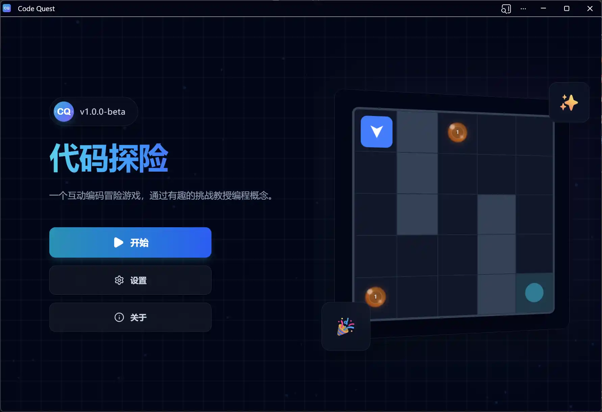

<div align="center">



# Code Quest

[](https://reactjs.org/)
[](https://www.typescriptlang.org/)
[](https://vitejs.dev/)
[](https://tailwindcss.com/)
[](https://microsoft.github.io/monaco-editor/)
[](https://web.dev/explore/progressive-web-apps)

一个互动编码冒险游戏，通过有趣的挑战教授编程概念。

[English](README.md) | [中文](README_zh.md)



</div>

## ✨ 核心特性

- **🎮 互动游戏玩法**: 通过有趣的解谜挑战学习编程
- **💻 专业级 IDE**: 由 **Monaco Editor** 驱动，支持智能感知、语法高亮和高级编辑器配置
- **⚡ 响应式游戏引擎**: 自研状态驱动引擎，支持实时代码解析和沙箱化执行
- **💾 持久化进度**: 游戏进度和代码片段自动同步至本地存储
- **🌐 多语言支持**: 英文与简体中文无缝切换
- **📱 PWA 支持**: 可安装的网页应用，支持离线使用

## 🛠️ 技术栈

| 类别 | 技术 |
|------|------|
| 框架 | React 18 + TypeScript |
| 构建工具 | Vite |
| 样式 | Tailwind CSS + Motion |
| 编辑器 | Monaco Editor |
| 代码执行 | JS-Interpreter (沙箱) |
| PWA | Vite PWA 插件 |

## 🚀 快速开始

```bash
# 克隆仓库
git clone https://github.com/Roy-Jin/Code-Quest.git

# 进入项目目录
cd Code-Quest

# 安装依赖
npm install

# 启动开发服务器
npm run dev
```

## 📁 项目结构

```
Code-Quest/
├── public/
│   ├── icons/
│   │   └── icon.svg          # 应用图标
│   ├── bgm.mp3               # 背景音乐
│   └── coinGet.mp3           # 音效
├── src/
│   ├── components/           # React 组件
│   │   ├── EditorPane.tsx   # Monaco 编辑器封装
│   │   ├── GameGrid.tsx     # 游戏棋盘渲染
│   │   ├── Header.tsx       # 应用头部
│   │   └── ...
│   ├── config/              # 游戏配置
│   │   ├── levels/          # 关卡定义
│   │   ├── commands.ts      # 可用命令
│   │   └── i18n.ts          # 国际化配置
│   ├── context/             # React Context
│   ├── hooks/               # 自定义 React Hooks
│   │   └── useGameEngine.ts # 核心游戏逻辑
│   ├── pages/               # 页面组件
│   │   ├── HomePage.tsx
│   │   ├── GamePage.tsx
│   │   ├── LevelSelectPage.tsx
│   │   ├── LevelEditorPage.tsx
│   │   └── SettingsPage.tsx
│   ├── utils/               # 工具函数
│   └── types.ts             # TypeScript 类型定义
├── vite.config.ts           # Vite 配置
└── package.json             # 依赖
```

## 🎯 游戏玩法

1. **选择关卡**: 从各种具有挑战性的关卡中选择
2. **编写代码**: 使用简单的命令控制角色
3. **运行调试**: 实时执行代码并查看结果
4. **收集金币**: 在到达目标的同时收集所有金币
5. **完成挑战**: 以最优解法解决谜题

### 可用命令

有关所有可用命令和属性的完整参考，请参阅 [命令参考](doc/commands_zh.md) 文档。

| 命令 | 描述 |
|------|------|
| `moveForward()` | 向前移动一格 |
| `turnLeft()` | 左转 90° |
| `turnRight()` | 右转 90° |

## 🤝 贡献

欢迎贡献！请随时提交 Pull Request。

## 📄 许可证

GPL v3 许可证

---

<div align="center">

由 ❤️ 构建 by [Roy-Jin](https://github.com/Roy-Jin)

</div>
